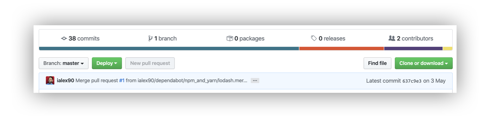
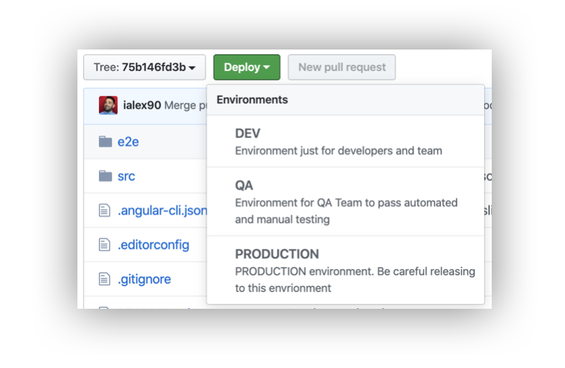
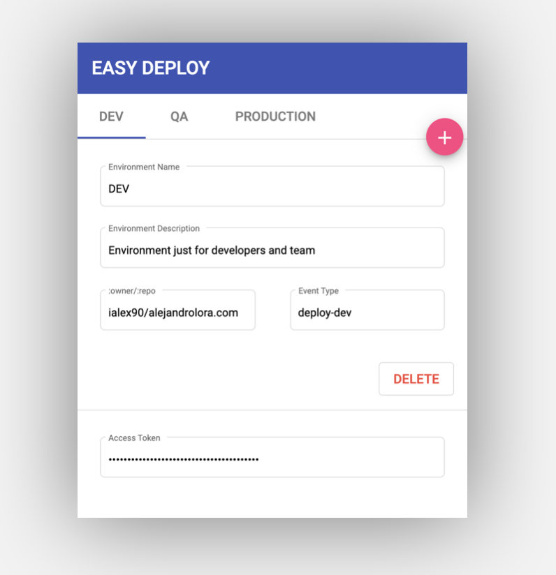
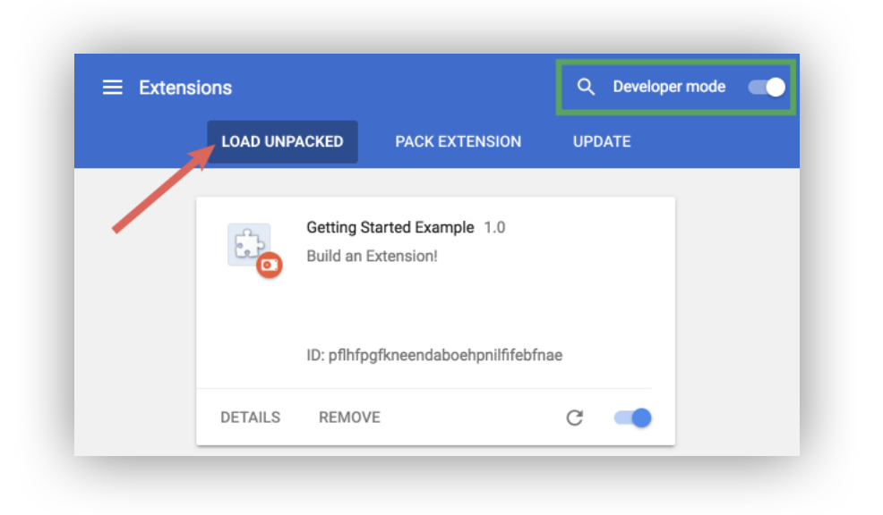

  

# Easy Deploy - Chrome Extension

This is a chrome extension that allows you to manually trigger a GitHub Action.

Deploy your code into the selected environment from your repository by a button straight from the GitHub UI.

Configure your environments providing minimal information and trigger a github action which can deploy your code into different environments from a branch, tag or commit.

_Screenshots:_

# Steps to use the extension

1. Download from [Chrome Web Store](https://chrome.google.com/webstore/detail/legogknlfnllbmijpohabichmkmhcefh/)
2. Go to some GitHub page since the popup only shows up under github domain.
3. Click on the extension to see a popup. Add the desired environments (Name, Description, Owner/Repo, Event Type, Token):
   - Name: Name displayed in the dropdown of the "Deploy" button.
   - Description: Short information shown below the name in the dropdown of the "Deploy" button.
   - Owner/Repo: Owner of the repository followed by the repository name.
   - Event Type: This value can be taken in the GitHub action to differentiate between environments: _\${{ github.event.client_payload.event_type }}_
   - Token: Personal token needed to dispatch actions on repositories. [Create one here](https://help.github.com/en/github/authenticating-to-github/creating-a-personal-access-token-for-the-command-line) - it requires permission for repo (the one which groups a few, first in the list).
4. You might need to refresh the tab after changing values in the popup. You now will see the deploy button in the configured repository.
5. Create a GitHub Action workflow to be triggered when pressing the deploy button. [See sample here](./.github/workflows/sample.yml)
6. Press the deploy button, and see how the action triggers automatically.

### How to run locally

1. Clone this repository and install dependencies using `npm install` inside the cloned folder
2. Run the local development server using `npm start` _(watch mode enabled)_
3. Open a new chrome tab with the following URL: <chrome://extensions/>
4. Enable developer mode and click **LOAD UNPACKED**

<figure>
  
  <figcaption><i><a href="https://developer.chrome.com/extensions/getstarted#manifest">Chrome documentation & image source</a></i></figcaption>
</figure>

5. Select the `dist/` folder
6. Open GitHub.com page and navigate to your repository, click on the extension to see the popup working.

Note: Keep in mind when developing locally, `background.ts` and `contentScript.ts` are being updated dynamically. However, sometimes you might need to manually update the extension content from the Chrome extension's page.

###  Getting started with chrome extension development

[This post](https://medium.com/angular-in-depth/chrome-extension-with-angular-why-and-how-778200b87575) guides you through the process of getting started with Chrome Extensions Development. I based my template from the code in [this repository](https://github.com/just-jeb/angular-chrome-extension)

### Contributions 

You are welcome to contribute to this project.
All suggestions/fixes/help are more than welcome. Add your feedback to [this todo list](https://github.com/ialex90/easy-deploy-extension/issues/1) for feature requests

Please contact me ([@alora90](https://twitter.com/alora90)) if you need some help getting started with the setup.
